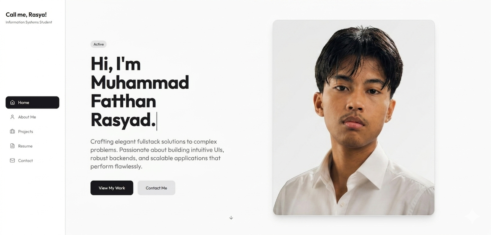

# 🌐 Personal Portfolio - Muhammad Fatthan Rasyad

A high-performance, minimalist personal portfolio designed to showcase my journey as a **Full-Stack Developer** and **Information Systems** student. Built with a focus on clean typography, intuitive user experience, and modern web standards.

<p align="center">
  
</p>

## 🚀 Overview
This repository contains the source code for my professional portfolio website. The site is designed to be a digital resume and project hub, reflecting a "clean-code" philosophy and a professional aesthetic.

## Try Look Up my Website [Portfolio](https://mfrasyad.xyz/)

## 🛠️ Tech Stack
* **Framework:** [React.js](https://reactjs.org/)
* **Styling:** [Tailwind CSS](https://tailwindcss.com/)
* **Deployment:** GitHub Pages
* **Component Library:** Radix UI / Shadcn (via `/components/ui`)

## ✨ Key Features
* **Minimalist UI:** A sleek, high-contrast black-and-white theme.
* **Responsive Architecture:** Fully optimized for mobile, tablet, and desktop screens.
* **Modern Workflow:** Utilizes custom hooks and utility libraries for clean, maintainable logic.
* **Smooth Navigation:** Sidebar-integrated routing for a seamless single-page application (SPA) experience.

## 📂 Project Structure
```text
└── apps/
    └── web/
        ├── src/
        │   ├── assets/       # Personal headshots and site assets
        │   ├── components/   # UI components (Shared & Shadcn UI)
        │   ├── hooks/        # Custom React hooks
        │   ├── lib/          # Utility functions and configurations
        │   └── pages/        # Main sections (Home, About, Projects)
        ├── tailwind.config.jsx # Design tokens and theme settings
        └── package.json      # Web app dependencies
``` 

## ⚙️ Local Development
To get this project running on your machine:

**1. Clone the repository:**
```copy
git clone [https://github.com/exawill/My-Website-Portfolio.git](https://github.com/exawill/My-Website-Portfolio.git)
```
**2. Navigate to the web app directory:**
```copy
Bash
cd My-Website-Portfolio/apps/web
```
**3. Install dependencies:**
```copy
Bash
npm install
```
**4. Start the development server:**
```copy
Bash
npm run dev
```
